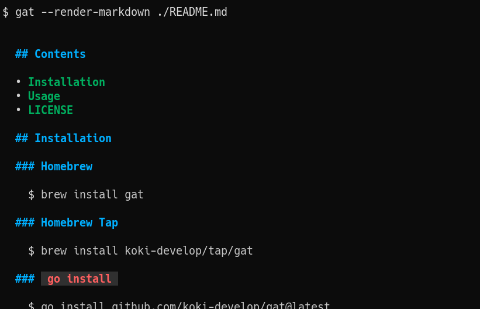

<p align="center">


</p>

<p align="center">
cat alternative written in Go.
</p>

<p align="center">
<a href="https://github.com/koki-develop/gat/releases/latest"></a>
<a href="https://github.com/koki-develop/gat/releases/latest"></a>
<a href="https://github.com/koki-develop/gat/actions/workflows/ci.yml"></a>
<a href="https://codeclimate.com/github/koki-develop/gat/maintainability"></a>
<a href="https://goreportcard.com/report/github.com/koki-develop/gat"></a>
<a href="./LICENSE"></a>
</p>

<p align="center">

</p>

## Contents

- [Installation](#installation)
- [Usage](#usage)
- [LICENSE](#license)

## Installation

### Homebrew

```console
$ brew install gat
```

### Homebrew Tap

```console
$ brew install koki-develop/tap/gat
```

### `go install`

```console
$ go install github.com/koki-develop/gat@latest
```

### Releases

Download the binary from the [releases page](https://github.com/koki-develop/gat/releases/latest).

## Usage

```console
$ gat --help
cat alternative written in Go.

Usage:
  gat [file]... [flags]

Flags:
  -b, --force-binary      force binary output
  -c, --force-color       force colored output
  -f, --format string     output format (default "terminal256")
  -h, --help              help for gat
  -l, --lang string       language for syntax highlighting
      --list-formats      print a list of supported output formats
      --list-langs        print a list of supported languages for syntax highlighting
      --list-themes       print a list of supported themes with preview
  -p, --pretty            whether to format a content pretty
  -M, --render-markdown   render markdown
  -t, --theme string      highlight theme (default "monokai")
  -v, --version           version for gat
```

### `-l`, `--lang`

Explicitly set the language for syntax highlighting.  
See [languages.md](./docs/languages.md) for valid languages.

### `-f`, `--format`

Set the output format ( default: `terminal256` ).  
Alternatively, it can be set using the `GAT_FORMAT` environment variable.
See [formats.md](./docs/formats.md) for valid formats.

### `-t`, `--theme`

Set the highlight theme ( default: `monokai` ).  
Alternatively, it can be set using the `GAT_THEME` environment variable.
See [themes.md](./docs/themes.md) for valid themes.

### `-p`, `--pretty`

Format a content pretty.  
For unsupported languages, this flag is ignored.

### `-M`, `--render-markdown`

Render markdown documents.  



### `-c`, `--force-color`

`gat` disables colored output when piped to another program.  
Settings the `--force-color` forces colored output to be enabled.  
This is useful, for example, when used in combination with the `less -R` command.


It is also useful to declare the following function to allow `gat` to be used with a pager.

```sh
function gess() {
  gat --force-color "$@" | less -R
}
```

### Print Image

If your terminal supports Sixel, you can print images.


Supported image formats include:

- JPEG
- PNG
- GIF (animation not supported)

## LICENSE

[MIT](./LICENSE)
